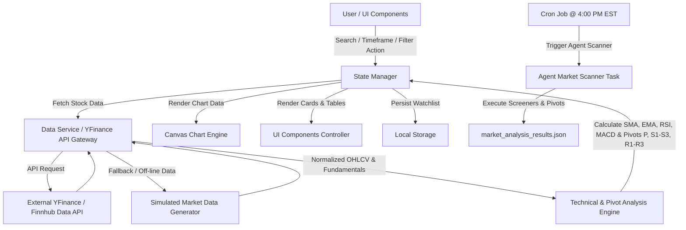

# Specification Document: Stock Market Analyzer

## 1. Overview & Vision
The **Stock Market Analyzer** is a state-of-the-art web application and analytical terminal designed for investors, traders, and financial analysts to track, visualize, and analyze stock market performance in real-time. Featuring a modern glassmorphic dark-mode interface, the platform provides intuitive search capabilities, customizable candlestick/line charting, advanced technical indicators (SMA, EMA, RSI, MACD, Pivot Points), key fundamental metrics, automated stock sentiment summaries, interactive watchlists, and an automated **Agent Market Scanner**.

### 1.1 Key Objectives
- **Visual Excellence**: Deliver a premium, high-density financial dashboard experience with responsive charts, dark theme aesthetics, and subtle micro-animations.
- **Analytical Depth**: Provide real-time data visualization alongside technical indicators and Pivot/Support/Resistance analysis to assist in fast market decisions.
- **Ease of Use**: Offer zero-friction stock searching, instantaneous chart updates, time frame switching (1D, 1W, 1M, 1Y, ALL), and personal watchlist persistence.
- **Automated Market Close Scanning**: Execute automated YFinance screening for market movers, sector indices, top sector equities, and the Magnificent Seven.

---

## 2. Target Audience & Core Use Cases

| Persona | Needs | Core Use Case |
| :--- | :--- | :--- |
| **Retail Investor** | Quick stock lookup, fundamental metrics, news sentiment | Searches tickers, checks P/E ratios and 52-week range, reads summary AI news sentiment. |
| **Technical Trader** | Chart analysis, indicators (RSI, MACD, Pivot/Support/Resistance levels) | Switches to Candlestick mode, inspects Floor Pivots (P, R1-R3, S1-S3) across timeframes. |
| **Portfolio Tracker** | Watchlist management, gain/loss tracking, sector screening | Adds target stocks to personalized watchlist, monitors percentage changes on dedicated Market Movers page. |

---

## 3. Key Features & Functionality

### 3.1 Live Market Overview & Ticker Bar
- Continuous scrolling market ribbon displaying top global indices (S&P 500, NASDAQ, Dow Jones, Russell 2000, Bitcoin, Ethereum).
- Color-coded percentage changes (+Green for bullish, -Red for bearish).

### 3.2 Interactive Stock Search & Autocomplete
- Global search bar supporting Ticker Symbols (e.g., `AAPL`, `TSLA`, `NVDA`, `MSFT`) and Company Names.
- Instant autocomplete dropdown listing matches with live spot prices and sector badges (`Ctrl+K` shortcut).

### 3.3 Advanced Technical Charting Canvas
- Dual Chart Modes: High-resolution **Candlestick Chart** (OHLC) and **Line Chart** with area gradient fills.
- Interactive Crosshair tooltip inspecting Date, Open, High, Low, Close, and Volume for individual bars.
- Timeframe Selectors: `1D`, `1W`, `1M`, `6M`, `1Y`, `5Y`, `ALL`.
- Overlay Technical Indicators:
  - **SMA (Simple Moving Average)**: 20-day, 50-day, 200-day lines.
  - **EMA (Exponential Moving Average)**: 12-day, 26-day lines.
  - **Bollinger Bands**: Upper band, Middle SMA, Lower band.
- Sub-chart Indicators:
  - **Volume Bars**: Color-coded based on bar direction.
  - **RSI (Relative Strength Index)**: 14-period indicator with 70 Overbought and 30 Oversold threshold lines.
  - **MACD (Moving Average Convergence Divergence)**: MACD line, Signal line, and Histogram.

### 3.4 Key Fundamentals & Valuation Panel
- Comprehensive key performance metrics displayed in styled cards:
  - **Market Capitalization**
  - **Price-to-Earnings (P/E) Ratio**
  - **Earnings Per Share (EPS)**
  - **Dividend Yield**
  - **52-Week High & Low Range Progress Bar**
  - **Average Volume & Beta**

### 3.5 Dedicated Market Movers Page (`movers.html`)
- Dedicated multi-page view sorting top gainers (winners) and decliners (losers).
- Screening rules: Price > $15.00, Volume > 1,000,000, and Relative Volume ($\text{RelVol} = \frac{\text{Volume}}{\text{AvgVolume}} \ge 1.0$).
- Filtering by Sector (`Technology`, `Healthcare`, `Energy`, `Financials`, `Industrials`, `Real Estate`, `Utilities`, etc.).
- Direct cross-navigation linking any mover row to the terminal chart dashboard (`index.html?ticker=SYMBOL`).

### 3.6 Dedicated Asymmetric Low-Risk Trades Page (`trades.html`)
- Dedicated multi-page view featuring the **Top 6 Asymmetric Low-Risk Trade Candidates** evaluated by the Critic Agent.
- Interactive featured cards and ranked screener table sorted by Risk/Reward ratio ($\text{R/R} \ge 1.2\text{x}$).
- Downside risk calculation to Stop-Loss ($S_1$), upside reward calculation to Take-Profit ($R_1$), and direct chart analysis cross-linking.

### 3.7 Dedicated Magnificent Seven & OSIS Page (`mag7.html`)
- Dedicated multi-page view for tech heavyweights (`AAPL`, `MSFT`, `NVDA`, `AMZN`, `GOOGL`, `META`, `TSLA`) + security technology leader `OSIS` (OSI Systems, Inc.).
- Technical Floor Pivot Points ($P, R_1, S_1$), Relative Volume ($\text{RelVol} = \frac{\text{Volume}}{\text{AvgVolume}}$), P/E ratios, market caps, and interactive stock selection.

### 3.7 Market News Highlights Page (`news.html`)
- Real-time financial headline feed curated directly from **Google News** (`news.google.com` RSS feed engine).
- **Categories**:
  - **Market Overview**: S&P 500, Wall Street, macro trends.
  - **Mag 7 & OSIS**: Specific news for Apple, Microsoft, Nvidia, Amazon, Tesla, Meta, Alphabet, and OSI Systems.
  - **Sector News**: Technology, Energy, Healthcare, Financials, Utilities.
  - **Macro & Fed**: Federal Reserve policy, interest rates, inflation metrics.
  - **Market Movers**: High-volume breakouts, earnings reports, stock rallies.
- **Features**: Interactive Category Filter Tabs, instant keyword search bar, source publisher badges (CNBC, Reuters, Bloomberg, WSJ, Seeking Alpha), relative timestamp tags, sentiment tags (Bullish / Neutral / Bearish), and direct external links to full Google News stories.

### 3.8 Agent Market Scanner & Integrated HTTP Server (per `market_scanner_agent.yaml`)
- **Automated Execution**: Runs at market close (`4:00 PM EST`, Mon-Fri cron schedule).
- **Data Source**: Fetches `Open`, `High`, `Low`, `Close`, `Volume`, and `AvgVolume` via `yfinance`.
- **Integrated Web Server**: Automatically launches Python `http.server` on **port 8080** serving `http://localhost:8080` immediately after scanning finishes. Supports `--no-serve` CLI argument for head-less background scan runs.
- **Screening Filter**:
  - Price > $15.00
  - Volume > 1,000,000
  - Relative Volume: $\text{RelVol} = \frac{\text{Volume}}{\text{AvgVolume}} \ge 1.0$
- **Universe Coverage**:
  - **Sector Indices**: `XLK` (Tech), `XLE` (Energy), `XLF` (Financials), `XLV` (Healthcare), `XLI` (Industrials), `XLC` (Comm), `XLY` (Cons Disc), `XLP` (Cons Staple), `XLU` (Utilities), `XLB` (Materials), `XLRE` (Real Estate).
  - **Top Sector Holdings**: Top 3 equities per sector (e.g. `AAPL`, `MSFT`, `NVDA` for XLK; `XOM`, `CVX`, `COP` for XLE).
  - **Magnificent Seven & Selected Equities**: `AAPL`, `MSFT`, `NVDA`, `AMZN`, `GOOGL`, `META`, `TSLA`, `OSIS`.
- **Floor Pivot Points Calculation**:
  $$\text{Pivot (P)} = \frac{\text{High} + \text{Low} + \text{Close}}{3}$$
  - **Resistance Levels**:
    - $R_1 = (2 \times P) - \text{Low}$
    - $R_2 = P + (\text{High} - \text{Low})$
    - $R_3 = \text{High} + 2 \times (P - \text{Low})$
  - **Support Levels**:
    - $S_1 = (2 \times P) - \text{High}$
    - $S_2 = P - (\text{High} - \text{Low})$
    - $S_3 = \text{Low} - 2 \times (\text{High} - P)$

---

## 4. Architecture & Data Flow



---

## 5. Data Models & Schemas

### 5.1 OHLCV Data Structure
```json
{
  "ticker": "AAPL",
  "name": "Apple Inc.",
  "timeframe": "1D",
  "data": [
    {
      "timestamp": 1725974400000,
      "open": 220.50,
      "high": 224.20,
      "low": 219.80,
      "close": 223.75,
      "volume": 48291000
    }
  ]
}
```

### 5.2 Agent Market Scanner Schema (`agent_market_scanner.yaml`)
```yaml
agent:
  name: "Agent Market Scanner"
  version: "1.0.0"

execution:
  schedule:
    cron_expression: "0 16 * * 1-5" # 4:00 PM EST
    event_trigger: "market_close"

data_source:
  provider: "yfinance"
  metrics: ["Open", "High", "Low", "Close", "Volume", "AvgVolume"]

screening_criteria:
  market_movers:
    min_price: 15.00
    min_volume: 1000000
    volume_condition: "Volume > AvgVolume"

technical_analysis:
  pivot_calculation:
    formula_type: "Standard Floor Pivots"
    pivot_point: "P = (High + Low + Close) / 3"
    resistance_levels: { R1: "2P - Low", R2: "P + (High - Low)", R3: "High + 2(P - Low)" }
    support_levels: { S1: "2P - High", S2: "P - (High - Low)", S3: "Low - 2(High - P)" }
```

### 5.3 Pivot Levels Calculation Output Schema
```json
{
  "ticker": "NVDA",
  "date": "2026-09-10",
  "ohlc": { "open": 115.20, "high": 119.50, "low": 114.80, "close": 118.40, "volume": 52800000 },
  "pivots": {
    "pivot": 117.57,
    "resistance": { "r1": 120.34, "r2": 122.27, "r3": 125.04 },
    "support": { "s1": 115.64, "s2": 112.87, "s3": 110.94 }
  }
}
```

---

## 6. UI/UX Design System & Theme Specification

### 6.1 Color Palette
- **Canvas / Background**: `#0b0f19` (Deep Obsidian Dark)
- **Card Background**: `#141c2e` (Glassmorphic Midnight Navy with `backdrop-filter: blur(12px)`)
- **Card Border**: `rgba(255, 255, 255, 0.08)`
- **Text Primary**: `#f8fafc` (Slate 50)
- **Text Secondary**: `#94a3b8` (Slate 400)
- **Bullish / Gain Accent**: `#10b981` (Emerald Green)
- **Bearish / Loss Accent**: `#f43f5e` (Crimson Red)
- **Primary Brand / Active State**: `#3b82f6` (Electric Blue)
- **Highlight Accent**: `#8b5cf6` (Neon Purple)

### 6.2 Typography
- **Primary Font**: `'Inter', system-ui, -apple-system, sans-serif`
- **Headings & Display Numbers**: `'Outfit', sans-serif`
- **Monospace (Prices / Metrics)**: `'JetBrains Mono', 'Fira Code', monospace`

---

## 7. Verification, Implementation & Critic Agent Roadmap

| Phase | Deliverable | Key Tasks |
| :--- | :--- | :--- |
| **Phase 1** | Project Setup & Shell | Create basic HTML/CSS structure, design system tokens, responsive grid. |
| **Phase 2** | Data Layer & Engine | Build market data fetcher with real-time ticker stream and mock fallback generator. |
| **Phase 3** | Canvas Charting | Implement interactive HTML5 Canvas / Chart engine supporting OHLC Candlestick & Line charts. |
| **Phase 4** | Technical & Pivot Engine | Write math routines for SMA, EMA, RSI, MACD, and Floor Pivots (P, R1-R3, S1-S3). |
| **Phase 5** | Market Movers Page | Implement `movers.html` with sector filtering and cross-navigation. |
| **Phase 6** | Agent Market Scanner | Implement cron-triggered YFinance scanner executing at market close (4:00 PM EST). |
| **Phase 7** | **Critic Agent Validation** | Automated YFinance price, volume, relative volume, and Floor Pivot math verification (`validated_yahoo_data.json`). |

### 7.1 Critic Agent Checklist Specifications
- **Live Price Cross-Validation**: Query YFinance API for all 45 symbols to verify Close, Open, High, Low, and Volume accuracy against `market_analysis_results.json`.
- **Pivot Calculation Audit**: Validate Floor Pivots ($P = \frac{\text{High} + \text{Low} + \text{Close}}{3}$), $R_1$, $S_1$ mathematical precision across all equities and sector ETFs.
- **RelVol Verification**: Verify $\text{RelVol} = \frac{\text{Volume}}{\text{Avg Volume}}$ ratio consistency.
- **Output Artifact**: Export verified dataset to [`validated_yahoo_data.json`](file:///c:/Users/nkonr/Documents/AI%20Agents/Agentic_Engineering/agent_engineering/my-apps/Stock_market_Analyzer/validated_yahoo_data.json).

---

## 8. Non-Functional Requirements
- **Performance**: Initial paint within <1 second; chart rendering frame rate maintained at 60 FPS.
- **Responsiveness**: Fully functional layout across Mobile (375px+), Tablet (768px+), and Desktop (1200px+).
- **Resilience**: Automatic fallback to simulated market generator if third-party stock APIs encounter rate limits.
- **Accessibility**: High-contrast dark theme exceeding WCAG AA standards, semantic HTML5 elements, and keyboard navigability.

